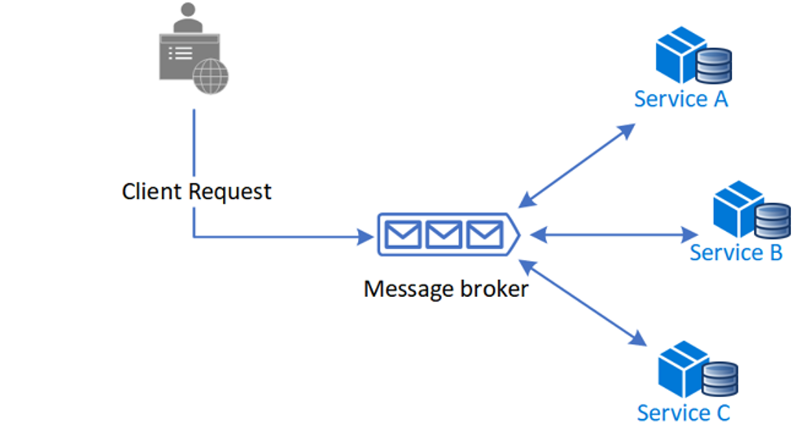
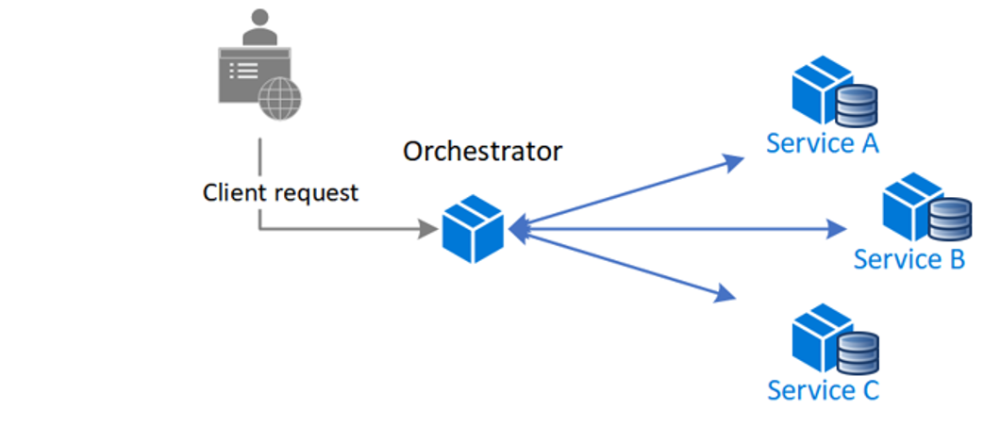

만약 우리가 쿠팡 같은 커머스 서비스를 개발한다면 가장 중요하게 생각해야하는건 뭘까? 아무래도 돈이지 않을까 싶다. 고객이 물건을 주문하면 등록된 결제수단으로 결제를 하고, 재고를 차감하고, 주문을 생성하고, 배송을 해줘야한다.

만약 위 과정중에 하나라도 문제가 생긴다면 어떻게 될까? 돈은 나갔는데, 재고를 없어서 주문이 생성되지 않았다면? 서비스와 데이터의 일관성과 무결성이 깨지고, 고객이나 우리 입장에서도 굉장히 난감한 문제가 발생할거다.

이런 데이터의 **일관성과 무결성을 보장**하기 위해 트랜잭션은 중요한 매커니즘이다.
## 트랜잭션이 뭔데

트랜잭션은 데이터베이스에서 **"더이상 분할이 불가능한 단위"** 를 의미한다. 물건을 주문 했다면 결제를 하고 재고를 차감하고 주문을 생성하는게 하나의 동작처럼 움직여야한다. 그러기 위해서 모든 동작은 모두 성공하거나 아니면 모두 실패해야만 한다.

일반적으로 트랜잭션은 Database를 통해서 관리할 수 있다. 그런데 서비스가 커지면 Database의 부하가 커질 수 있고, 나아가 MSA 구조로 변경된다면 일반적인 방식으로는 이 데이터 일관성을 보장할 수 없어진다.

서비스 규모가 커짐에 따라 우리가 고려할 수 있는 트랜잭션 관리 방식을 소개하고자 한다.

## 서비스 규모별 적용할 수 있는 트랜잭션

쿠팡에서 물건을 주문하는 상황을 가정해보자. 고객이 주문하기를 클릭하면 아래의 순서대로 요청을 처리하고 주문 결과를 반환해야한다.
1. 재고 확인 및 재고 감소
2. 결제 처리
3. 주문 생성
4. 배송 정보 등록

## Database를 통한 트랜잭션

Database에서 트랜잭션을 구현하는 방법은 심플하다. 하나의 트랜잭션을 생성하고, 그 안에서 일련의 과정을 처리한 후 종료하는 것이다. 트랜잭션을 생성하면 종료될때까지 반영된 내용은 Database에 바로 기록되지 않고 임시로 존재하다가 종료되는 시점에 **COMMIT** 되는 것이다.

만약에 트랜잭션 내에서 오류가 발생한다면 Try Catch를 타고 수정된 내용이 **ROLLBACK** 되는 것이다. 

```ts
async order(Order order) {
	await prisma.$transaction(async (tx) => {
		// 재고 확인 및 감소
		await this.stockService.reducePty(order.productId, order.pty, tx);
		// 결제 처리
		await this.paymentService.pay(order.paymentDetail, tx);
		// 주문 생성
		await this.orderService.createOrder(order, tx);
		// 배송 정보 등록
		await this.deliveryService.createDelivery(order, tx);
	})
}
```

위와 같이 생성한 트랜잭션을 하위 서비스로 전파하고 모든 서비스의 동작이 완료되면 내용이 저장되는 것이다. 실패 시 ROLLBACK 되는 것이 기본이지만, Try Catch를 통해 동작을 직접 처리해 줄 수도 있다.

여기서 재고 확인 및 감소 부분에 대해서 더 생각해보자. 재고를 감소시키기 위해서는 현재 재고가 몇개인지부터 확인해야한다. 현재 재고를 확인해서 없다면 에러를 발생해야하고, 있다면 주문량에 맞게 감소시켜야한다. 

만약에 인기가 너무 많은 상품이라 여러명이 동시에 주문을 한다면 어떻게 될까? 상품은 10개뿐인데 100명의 유저가 동시에 재고를 확인하면 10개를 결과를 받을 것이다. 그러고 -1을 해서 업데이트하면 주문량이 -90이 될 것이고, 실제 상품보다 90개의 주문을 더 생성하는 문제가 발생한다.

### 낙관락과 비관락

위의 문제와 같은 데이터 충돌을 해결하기 위해서는 재고를 확인할때 다른 요청들은 대기를 하도록 만들어주거나, 재고를 확인하지 못하도록 해야한다. 이때 사용할 수 있는 방식이 낙관락과 비관락이다.

#### 낙관락

낙관락은 재고를 확인하고, 감소시킨 재고로 업데이트할때 충돌 여부를 판단해서 적용하는 방식이다. 데이터에 버전 정보를 남기거나 하는 방식으로 내가 가져올 때와 업데이트할 때 같은 버전에 대해서 수정하고 있는지를 확인하는 것이다. 

```sql
-- 현재 버전 조회
SELECT Version INTO @CurrentVersion FROM YourTable WHERE YourID = 1;

-- 버전 체크와 함께 업데이트 시도
UPDATE YourTable
SET Column1 = 'NewValue', Version = @CurrentVersion + 1
WHERE YourID = 1 AND Version = @CurrentVersion;

-- 업데이트 성공 여부 확인
IF @@ROWCOUNT = 0
    RAISERROR ('동시 수정으로 인해 업데이트 실패', 16, 1);
```

비관락에 비해 Database의 부하가 적다는 장점이 있지만, 실패 시 재시도를 통해서 요청을 지속적으로 발생시켜야하고 재시도 횟수의 예측이 틀렸다면 성공적인 실패 수보다 더 많은 실패가 발생할 수 있다. 10개의 재고에 100명이 접근했다면 90명만 실패해야 하는데, 가져올때의 버전 정보에 따라 90명 이상으로 실패하는 상황이 발생할 수 있다는 것이다.

이런 특징 때문에 **충돌이 많이 발생하지 않을 것으로 예상되는 상황**에서 사용하는 것이 좋다.

#### 비관락

비관락은 Database에 재고를 감소시킬 목적으로 데이터를 가져온다는 사실을 알리는 방식이다. Database에서 직접 충돌을 방지해주기 때문에, 앞의 요청이 종료될때까지 다른 요청은 해당 데이터에 접근하지 못하고 대기하게된다.

```sql
-- 비관적 락을 사용하여 레코드 선택
BEGIN TRANSACTION;

-- 배타적 락(Exclusive Lock)을 획득
SELECT *
FROM YourTable
WHERE YourID = 1
FOR UPDATE;

-- 데이터 업데이트
UPDATE YourTable
SET Column1 = 'NewValue'
WHERE YourID = 1;

-- 트랜잭션 커밋
COMMIT;
```

순차적으로 요청이 처리되기 때문에 강력한 동시성 제어를 제공하지만, 앞의 요청이 종료될때까지 다른 요청이 대기해야하는 문제가 발생한다. N개 이상의 작업이 서로 작업이 종료되기를 기다리는 데드락(Deadlock) 문제가 발생할 수도 있다. 그리고이 과정을 Database가 제어하기 때문에 부하도 많이 발생하게 된다.

> 여기서 Lock은 트랜잭션이 종료되는 시점에 반환된다. 만약 Lock을 걸어둔 이후에 작업이 소요시간이 길어진다면, Lock을 반환하는 시간도 같이 길어지게된다. Database의 부하가 더 커질 수 있기 떄문에, 트랜잭션 내 동작은 최소화 되어야하고 외부 API를 호출하는 등의 오래 걸리는 작업은 분리해줄 필요가 있다.

## Redis를 통한 트랜잭션

비관락을 통해서 트랜잭션을 컨트롤하고 있는데, 사용자가 많아져서 Database의 부하가 심해졌다고 해보자. Lock 반환을 기다리는 요청이 많아져서 Database의 부하가 커지면 서비스 장애로 이어질 수 있다. 어떻게 하면 Database의 부하를 줄일 수 있을까?

이때 우리는 Redis를 이용한 Redlock 개념을 생각해 볼 수 있다.

Redlock은 트랜잭션 전체에 대한 Lock을 Redis에서 제어해주는 알고리즘이다. Database 트랜잭션 실행 전에 Redis에서 먼저 Lock을 획득해 처리를 완료하고 반환함으로서 대기의 책임을 Redis로 분리해주는 것이다.

```ts
async order(order: Order) {
  const lockKey = `order:${order.productId}`;
  const ttl = 30000; // 락 유효 시간 (30초)

  try {
    // Redlock을 사용하여 락 획득
    const lock = await redlock.lock(lockKey, ttl);

    try {
      await prisma.$transaction(async (tx) => {
        // 재고 확인 및 감소
        await this.stockService.reducePty(order.productId, order.pty, tx);
        // 결제 처리
        await this.paymentService.pay(order.paymentDetail, tx);
        // 주문 생성
        await this.orderService.createOrder(order, tx);
        // 배송 정보 등록
        await this.deliveryService.createDelivery(order, tx);
      });
    } finally {
      // 트랜잭션 완료 후 락 해제
      await lock.unlock();
    }
  } catch (error) {
    if (error instanceof Redlock.LockError) {
      console.error('락 획득 실패:', error.message);
      throw new Error('주문 처리 중 충돌이 발생했습니다. 잠시 후 다시 시도해주세요.');
    }
    throw error;
  }
}
```

> Redis에서 Lock을 획득하기 위해서 **과반수 합의** 라는 방식을 사용하게 되는데, 여러 Redis 인스턴스를 두고 과반수 이상의 Lock을 획득하면 유효한 Lock으로 간주하는 것이다. 이를 통해 단일 실패 지점(SPOF)을 방지하고 신뢰성을 높일 수 있다.

## MSA에서의 트랜잭션

만약 서비스가 더 커져서 MSA 구조로 각 서비스를 분리하게 되면 위에 소개한 방식으로 트랜잭션을 관리하기 어려워진다. 각 서비스가 독립된 Database를 가지기 때문에 Database에서 일관성을 보장해줄 수 없기 때문이다.

Redlock이 해결책이 되어줄 수는 있지만 실패 시 Lock만 반환되고 이전에 작업들은 ROLLBACK 하지 못한다. 

MSA 구조에서는 Kafka와 같은 메세지 브로커를 통해서 각 서비스가 연쇄적으로 동작하게 되는데, 이 과정에 SAGA 패턴과 Outbox 패턴을 통해 트랜잭션을 컨트롤 할 수 있다.

### SAGA 패턴

SAGA 패턴은 일련의 과정 중 실패가 발생했을때 **보상 트랜잭션**을 발생시켜 이를 상쇄하는 방법이다. 전체 작업에 실패 사실을 전파하고 ROLLBACK을 요청하는 것인데, 이 과정에서 일시적으로 불일치 상태를 가질 수 있지만 최종적으로는 **결과적 정합**을 보장하는 것이다.

### 코레오그래피 기반 사가

각 서비스가 자체적으로 이벤트를 발행하면서 순차적으로 서비스가 동작되도록 하는 방식이다. 재고 서비스에서 재고 관리 및 재고 차감을 완료했다면 완료 이벤트를 발행하고, 결제 서비스에서 이벤트를 소비해 결제 처리를 진행하는 것이다.

이 과정 중 오류가 발생하면 실패 이벤트를 발행하면서, 역순으로 다시 ROLLBACK을 실행하게 되는 것이다.

서비스 전체가 연쇄적으로 동작하기 때문에 구성이 편리하지만, 서비스가 많아질 경우 흐름을 파악하기가 어려워지고 서비스 간 결합도가 높아지는 문제점이 있다.



### 오케스트레이션 기반 사가

전체 트랜잭션을 관리하는 중앙 조정자가 각 서비스에 이벤트를 발행하고 응답을 받아서 순차적으로 처리하는 방식이다. 중앙에서 관리하기 때문에 트랜잭션의 흐름이 명화해지고 서비스 간 결합도가 낮아지는 장점이 있지만, 반대로 중앙 조정자가 SPOF가 될 수 있다는 문제가 있다.


### Outbox 패턴

각 서비스와 메시지 발행간의 원자성을 보장하기위해 Outbox 테이블에 이벤트 저장해 상태를 공유하고 변경에 따라 동작할 수 있도록 하는 방식이다.

서비스가 데이터를 변경할때 Outbox 테이블에 이벤트 데이터를 생성하고, 이 테이블을 모니터링하고 있는 서비스에서 메시지를 발행해주는 것이다. 그렇게 전체 서비스가 완료되고 나면 Outbox 테이블에서 이벤트를 삭제하거나 완료 처리해주게 된다.

분산된 서비스들 간의 느슨한 결합을 유지하면서, 일관성을 보장해줄 수 있다. 또한 이벤트 수신 여부도 포함하기 때문에 실패한 이벤트를 지속적으로 재발행해 결과적으로 완료될 수 있도록 할 수 있다.

## 마치며

서비스 규모가 커짐에 따라 MSA가 꼭 정답은 아니지만 많은 서비스에서 선택받고 있다. 그에 따라 트랜잭션을 유지하기 위해 더 많은 노력이 포함되기 때문에 고려할 부분이 많았던 부분인 것 같다.

---

위에서 설명한 대규모 서비스에서의 동시성 제어는 항해 플러스를 진행하면서 배웠던 내용이다. 실제 현업에서 경험할 수 는 없었지만, 교육을 통해 배우고 과제로 실습해보는 경험은 굉장히 소중했던 것 같다.

> 아래 추천 코드를 지원페이지에 입력하면, 등록금 20만 원을 할인 받을 수 있습니다.
>
> [항해 플러스 알아보기](https://bit.ly/3JV04NX)
>
> 추천인 코드 : QdEIWZ