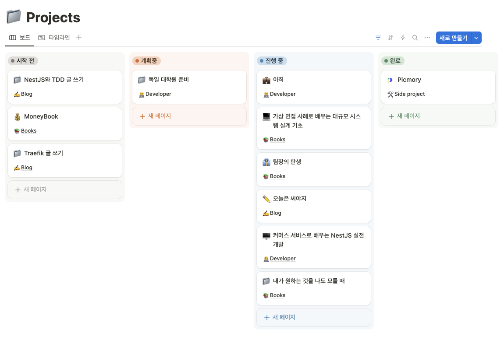
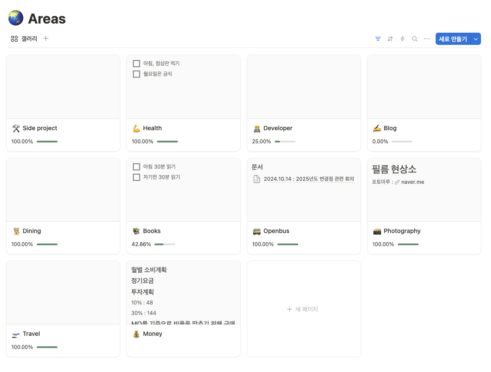
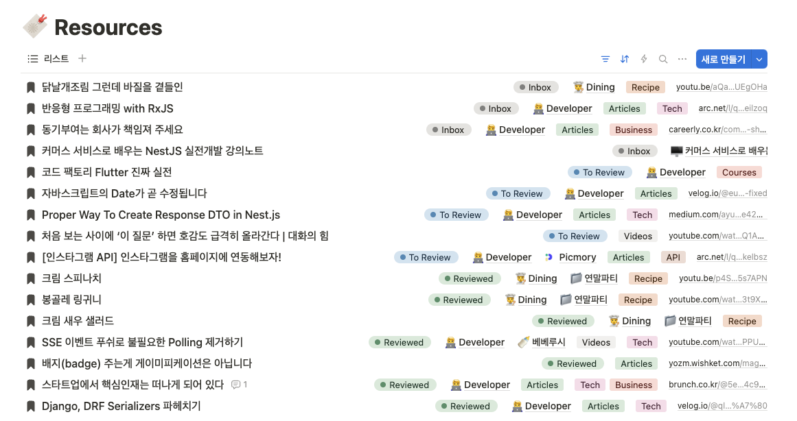
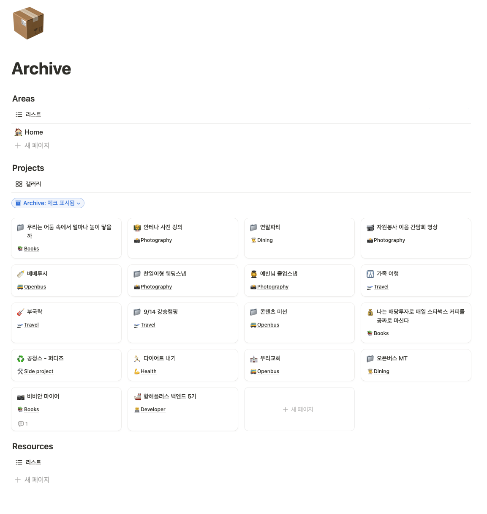

나는 새로 나온 앱이나 서비스가 있으면 항상 다 써보고 좀만 좋다고 생각되면 짐을 바리바리 싸 들고 이사를 준비한다. 소프트웨어 얼리어답터라고 할 수 있겠다.

메모 앱도 그렇듯이 노션, 옵시디언, 베어, 애플 메모 등 여러 번의 이사가 있었던 것 같다. 노션이 한창 인기를 끌며 나왔을 때 나도 노션 최고야! 하면서 뛰어들었고 편리하지만 무겁고 높은 자유도에 어렵다고 느꼈다.

옵시디언이 나왔을 때는 개발자인 나로서는 최고라고 생각했다. 플러그인에 파일 간 연결을 그래프로 보여준다니? 하지만 마크다운은 모바일에서 사용하기엔 너무나 번거로운 문법이었다.

여러 차례 메모 앱을 바꾸다 앱이 아닌 정리법이 중요하다는 영상을 보게 되었었다. 그게 PARA와의 첫 만남이었고, 이제는 노션에서 PARA로 정착한 이야기를 나누려고 한다.

## PARA 정리법

PARA는 가장 중요한 컨셉인 Project, Area, Resources, Archive의 앞 글자를 모아서 부르는 말이다. 모든 메모들을 각 목적에 맞게 나눠 작성하고 시간이 지남에 따라 옮기는 것이다.

주방을 정리하는 것과 유사하게 볼 수 있는데 그릇은 그릇끼리 식재료는 식재료끼리 모으면서 자주 쓰는 건 꺼내놓고, 쓰지 않는 넣어두면서 지속적으로 그 위치가 변하는 것이다.

### Proejct

목표와 데드라인이 명확한 일들을 의미한다. 예를 들면 사이드 프로젝트나 지금 읽고 있는 책 그리고 강의 같은 것들을 의미한다. 나는 여행이나 취미 활동 같은 것도 여기에 포함시키는 편이다.

Project는 시작 전, 계획 중, 진행 중, 완료와 같이 상태를 가지게 하는 게 좋다. 내가 계획하고 있는 일들과 지금 진행 하는 것들을 구분해 두고 그 안에서 너무 많은 프로젝트를 동시에 진행해 무리하지 않도록 조율해 나갈 수 있다.

그리고 그 Project 내에는 자잘한 Todo List 들을 둔다. 사이드 프로젝트인 경우 마일스톤 별로 Todo를 만드는 편이고, 공부인 경우 학습, 복습, 회고 와 같은 Todo를 만드는 편이다. Project의 전체 기간이 꽤 길 수 있기 때문에, 세부 사항은 Todo로 관리 해주는 것이다.

### Area

Area는 꾸준히 신경 써야 하는 것들, 나의 정체성을 이루는 요소들을 두는 공간이다. 예를 들면 돈 관리나 개발자 커리어같이 Project보다 더 큰 범위에 장기간으로 이뤄지는 것들이다.

나는 Area내에 Project를 포함시키는데 그 이유는 그 Area를 이뤄내기 위한 Project 들이 구성되기 때문이다. 개발자라는 Area가 있다면 그 안에 강의 듣기, 개발 서적 읽기, 항해플러스 같은 Project 들을 포함된다. Project에 시작 전, 진행 중, 완료와 같은 상태가 있기 때문에, 전체 달성률 같은 지표를 사용할 수 있어서 상태를 파악하기 좋다.

### Resources

각 주제별로 자료들을 모아두는 곳이다. 어떻게 보면 가장 중요한 부분이지 않을까 싶다. 공부한 내용을 정리하거나, 읽어볼 만한 아티클들을 모아두는 것이다. 커리어리나 블로그들을 보면서 와 이 글 진짜 좋은데? 라던가 이거 두고두고 보고싶다. 하는 식의 자료들을 모아두는 편이다.

이 자료들은 각 Project와 Area에 참조할 수 있도록 하는데, 어떤 Proejct를 진행하다가 찾게된 글 들이나 자료들을 연관 지어서 찾아 볼 수 있게 하기 위함이다.

나는 아티클이나 영상인 Resource는 다 보고난 뒤에 정리한 점이나 생각한 부분들을 추가로 달아서 그때의 생각을 담아서 보관하는 편이다.

### Archive

완료된 프로젝트나 더 이상 필요 없어진 Area, Resource를 모아두는 곳이다. 그 동안의 자료들을 지우지 않고 담아둠으로서 나중에 다시 필요할 때 꺼내보기도 하고, 내가 이만큼 지나왔구나 하고 느끼게 해주는 것들이 있다.

---

위에서 소개한 Project, Area, Resource, Area에서 가장 중요한 것은 문서의 위치가 유동적으로 변한다는 것이다. 아까 주방에 비유한 것처럼 시간이 지남에 따라 기구나 식재료들은 중요도가 변경된다. 자주 쓰는 것들은 다시 꺼내서 가까운 곳에 두고, 안쓰게 된 것들은 다시 담아두는 것이다.

## 그래서 나는 어떻게 활용하나

개발할 때와 플로우가 비슷한데, 가장 큰 Area부터 정리한다. 내 인생에서 중요하고 꾸준하게 신경 쓰는게 뭐지? 라고 생각하면서 Area들을 먼저 생성한다. 나 같은 경우엔 사이드 프로젝트, 개발자, 책, 여행 등 다양하게 분야를 나눠봤다.

그 다음 계획하고 있는 것들을 Project로 작성한다. 해야지~하면서 쌓아둔 것들과 지금 하고 있는 것들을 정리하면서 까먹고 있던 것은 없었는지 다시 점검하는 거다. 그리고 그 안에 세세한 Todo를 추가하면서 디테일을 잡아간다.

그러고 Project를 진행하면서 공부한 것, 찾아본 것, 내용들을 정리해서 Resource로 추가하고 서로 연결해준다.

그리고 끝난 Proejct들은 완료로 상태를 변경하고 다시 진행하지 않을 것 같은 Proejct들은 Archive로 위치를 바꿔준다.

## 마치며

결국 Notion으로 정착한 이유는 PARA의 각 영역을 Database의 참조를 이용해서 묶어서 사용할 수 있고, 모바일에서 사용하기도 어렵지 않아서 였다. 지극히 개발자스러운 사고방식의 이유일 수는 있으나, 내 나름 사용하기 편한 방식이기 때문인 것 같다.

최근 Second brain이라고 하면서 정리하는 것들도 알려지면서 다양한 정리법이 나와있는 것 같은데, 그 방법 중 하나라고 봐주면 좋겠다.

> 참고 자료
> 
> [https://youtu.be/lkRQuMIbFYc?si=CxjY6LD_owAdbF6P](https://youtu.be/lkRQuMIbFYc?si=CxjY6LD_owAdbF6P)
>
> [https://www.youtube.com/watch?v=HvSBfnQmEiU](https://www.youtube.com/watch?v=HvSBfnQmEiU)
>
> [https://www.youtube.com/watch?v=AsJ0EL8ffro](https://www.youtube.com/watch?v=AsJ0EL8ffro)

---

> 아래 추천 코드를 지원페이지에 입력하면, 등록금 20만 원을 할인 받을 수 있습니다.
>
> [항해 플러스 알아보기](https://bit.ly/3JV04NX)
>
> 추천인 코드 : QdEIWZ